# 🧠 Social Media Platform – Frontend

A modern and modular **social media platform frontend** built with [Next.js](https://nextjs.org/), [React](https://react.dev/), [Tailwind CSS](https://tailwindcss.com/), and [Socket.IO](https://socket.io/). This project is ready for backend integration and designed with scalability and real-time communication in mind.

---

## 📸 Preview

<!-- Add your screenshots or GIFs here -->
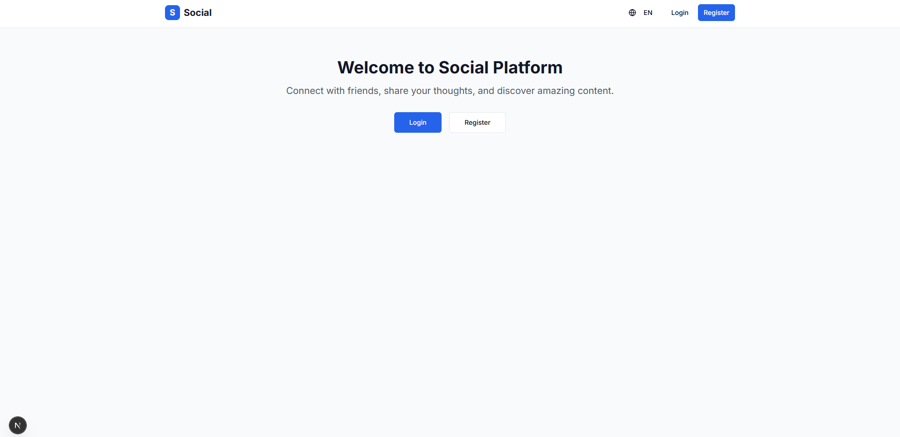 | 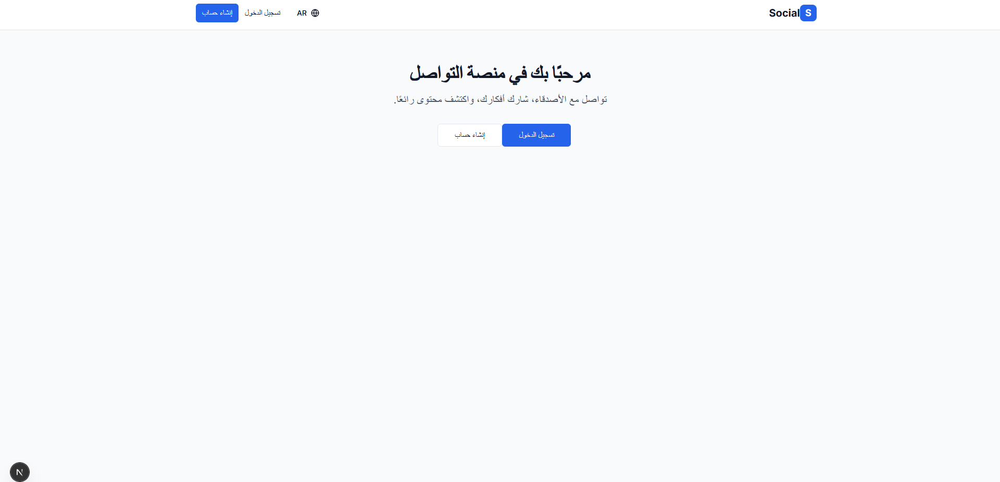
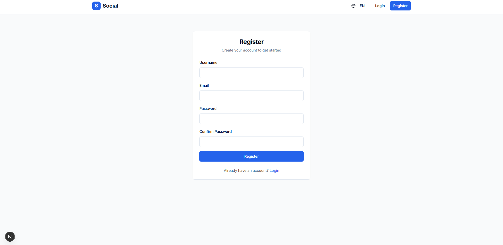 | 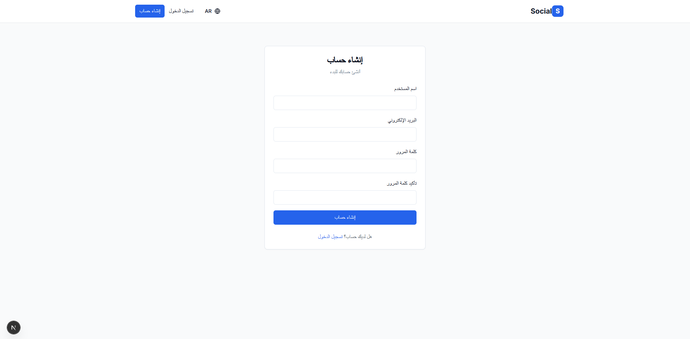
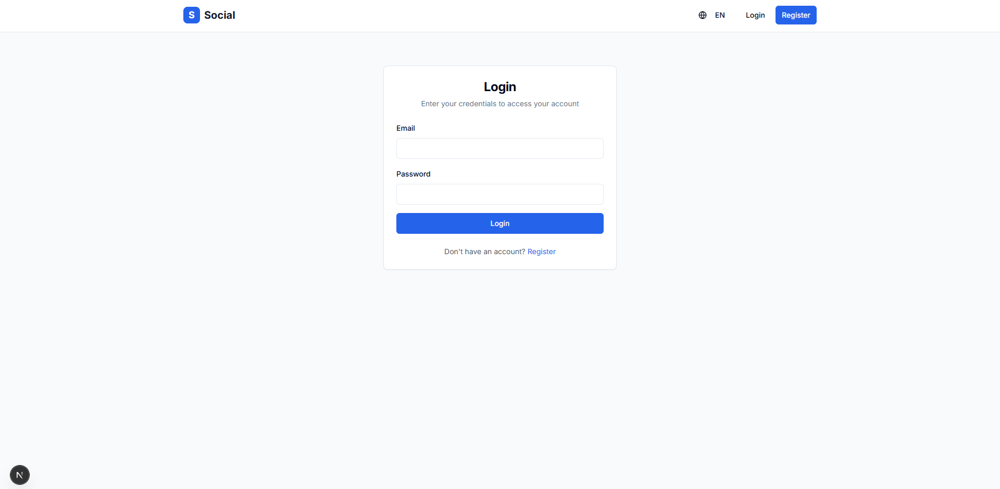 | 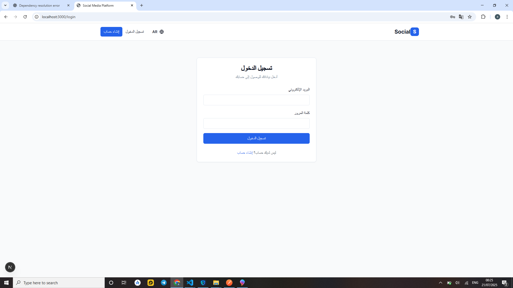
 | 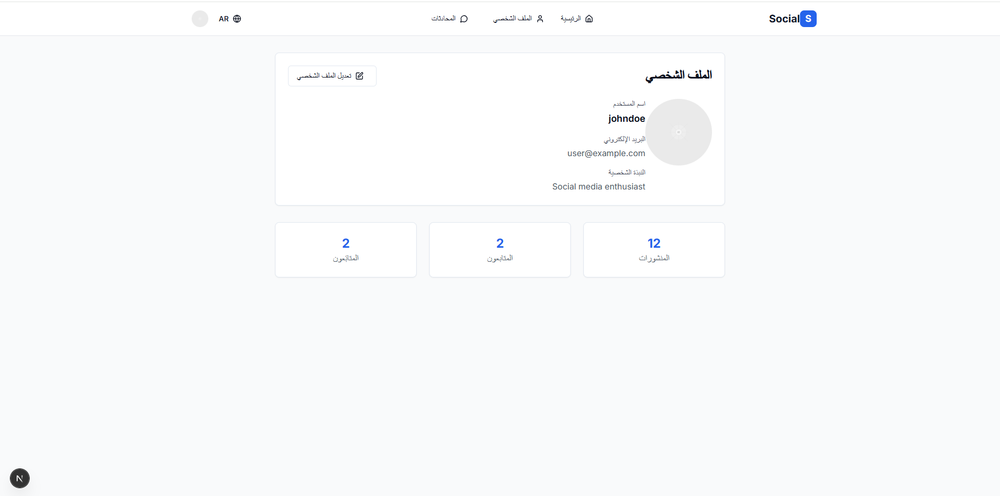
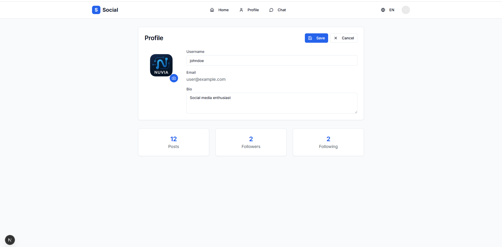 | 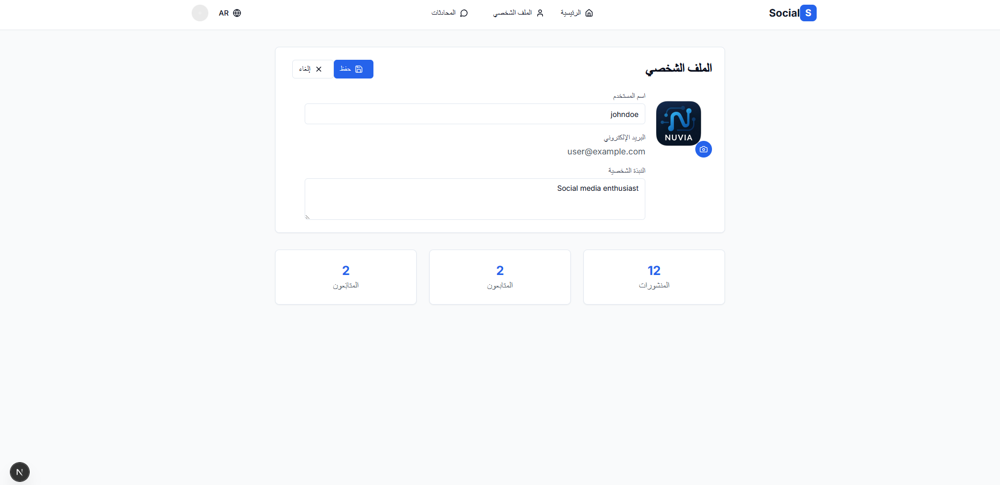
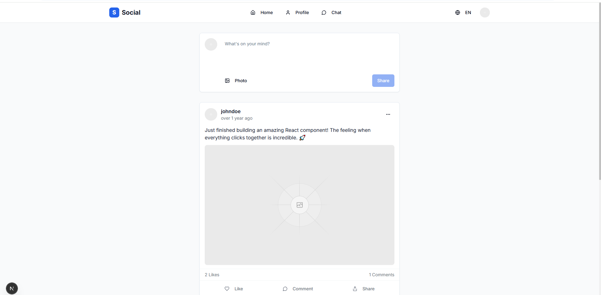 | | 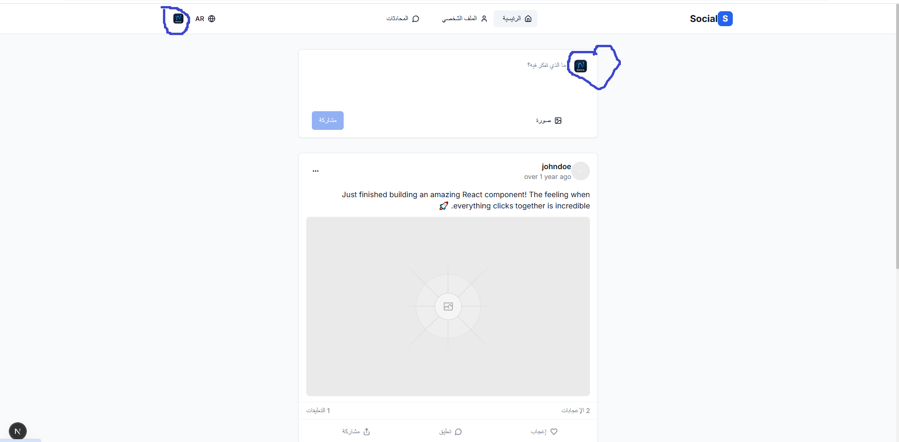
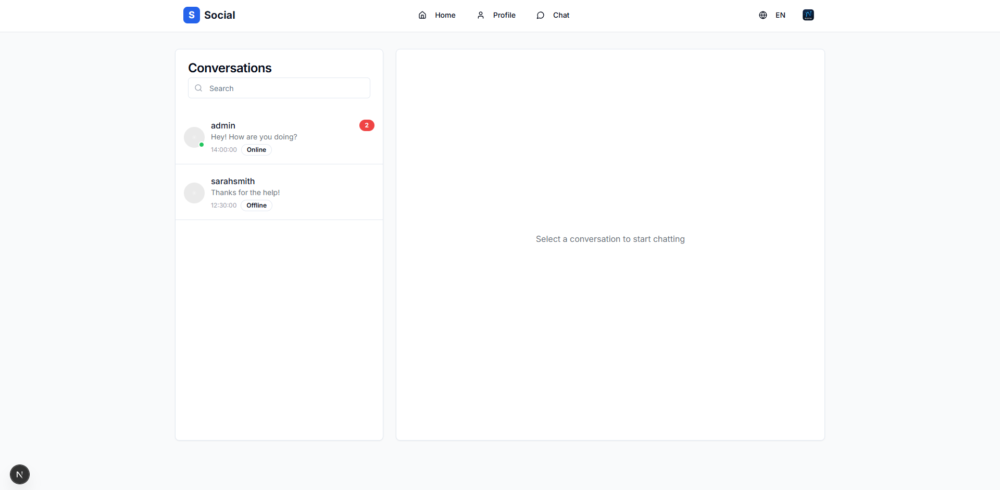 | 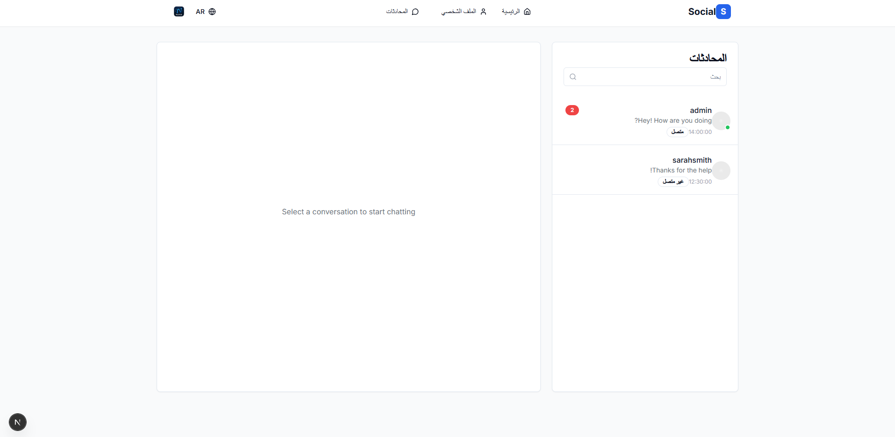
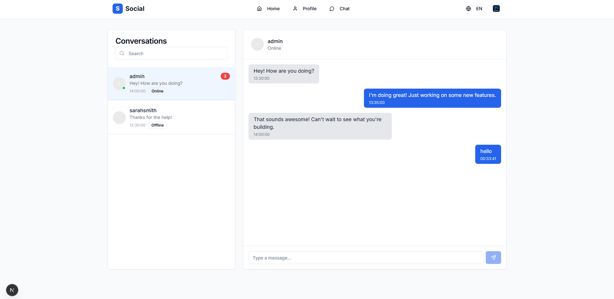 
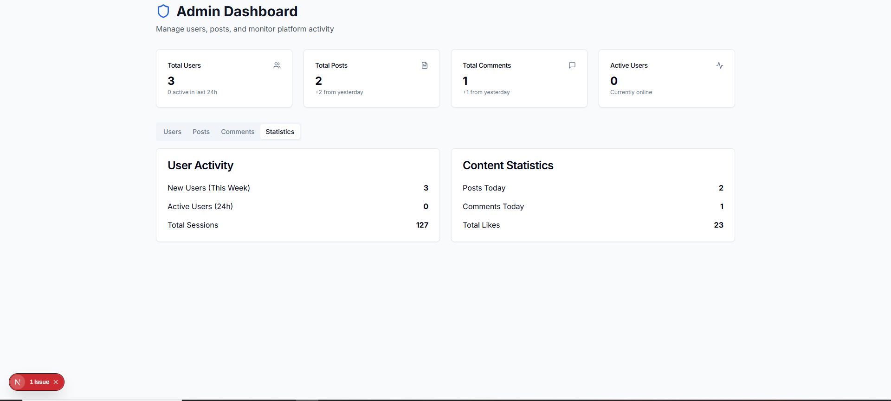 | 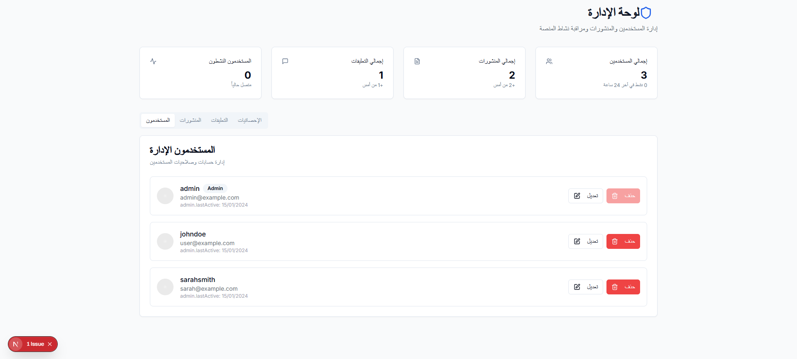 | 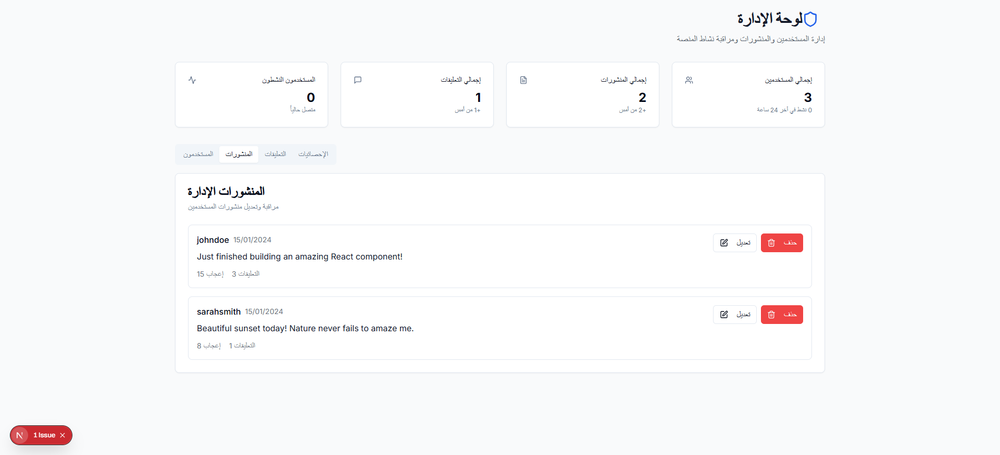 | 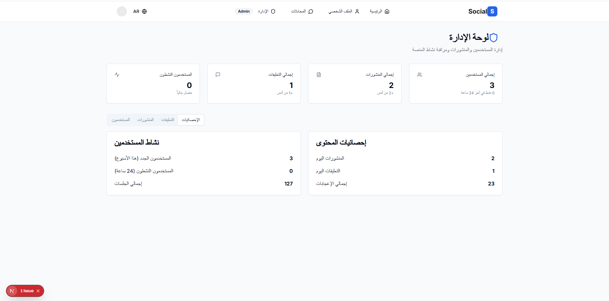 | 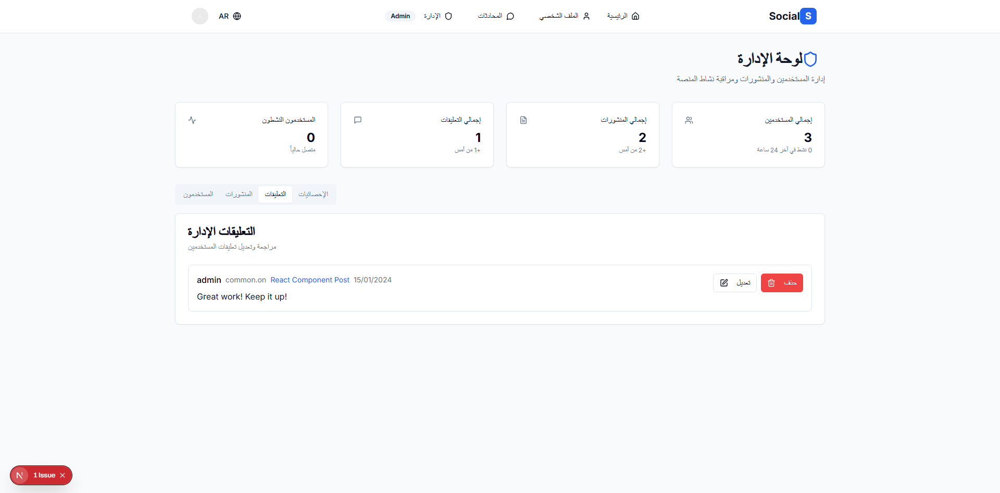


---

## ✨ Features

- 🔒 **Authentication-ready** UI
- 🧵 Modular component structure
- ⚡ **Socket.IO support** for real-time interactions
-  MultiLanguage Arabic & English
- ⚛️ Built with TypeScript & Tailwind CSS
- ⚙️ Clean and extensible codebase
- 🧰 Ready to integrate with any backend (Node.js, Firebase, etc.)

---

## 🧪 Tech Stack

- **Framework**: Next.js (App Router)
- **UI**: React, Tailwind CSS
- **Language**: TypeScript
- **Real-time**: Socket.IO (Client-side only)
- **Package Manager**: PNPM

---

## 📁 Project Structure (Simplified)

```
social-media-platform/
├── app/                 # Next.js app routing
├── components/          # Reusable React components
├── hooks/               # Custom React hooks
├── lib/                 # Utility functions and libraries
├── public/              # Static assets
├── styles/              # Global styles
├── package.json         # Dependencies and scripts
├── tailwind.config.ts   # Tailwind CSS config
├── tsconfig.json        # TypeScript config
```

---

## 🚀 Getting Started

1. **Clone the repository**  
   ```bash
   git clone https://github.com/CTechBridge/social-media-platform.git
   cd social-media-platform
   ```

2. **Install dependencies** (using PNPM)  
   ```bash
   pnpm install
   ```

3. **Run the development server**  
   ```bash
   pnpm dev
   ```

4. Open [http://localhost:3000](http://localhost:3000) to view the app in the browser.

---

## 📡 Socket.IO Integration

The app includes Socket.IO client setup. You can connect it to your backend like this:

```ts
import { io } from "socket.io-client";

const socket = io("http://localhost:5000", {
  transports: ["websocket"],
});
```

Make sure to configure this in your `lib/socket.ts` or wherever appropriate.

---

## 📌 Notes

- This is a **frontend-only** application, but structured to easily plug into any backend.
- Placeholder screenshots can be added under `/public` or updated in this README.

---

## 📄 License

MIT – Free to use and modify for personal or commercial projects.

---


> Developed by TechBridge – Feel free to contribute or fork 🌟

---

## 🤝 Hire Me

If you want this project customized or need a similar one built for you,  
contact me via email: [alihosaenhabibjobs@gmail.com]  (mailto:alihosaenhabibjobs@gmail.com)
or 
contact me via email: [techbridgeali123@gmail.com]  (mailto:techbridgeali123@gmail.com)